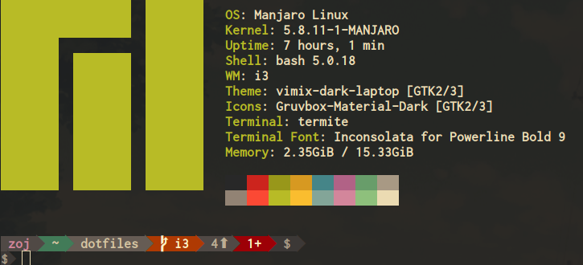

# My dotfiles
Dotfiles for my Manjaro XFCE setup. It may partially work with KDE Plasma as well.



## Script details
- `symlink.sh`: Sets up the symbolic links of the relevant dotfiles in the home directory.
- `install_packages.sh`: Installs basic packages for the system, development, audio and others.
- `install_packages_extras.sh`: Extra non-core packages not installed in the main setup script.
- `install_powerline.sh`: Installs powerline fonts and powerline-go for the shell.
- `install_pyenv.sh`: Installs pyenv and pyenv-virtualenv to aid my python dev workflow.
- `install_vundle.sh`: Installs Vundle and sets up all my vim plugins.
- `theming.sh`: Installs themes and fonts plus automates some window manager & desktop settings to my preference.
- `setup.sh`: Runs the other scripts except for `theming.sh` and `install_packages_extras.sh`. Those are ran manually
- `cmus_gruvbox_theme.sh`: Download the cmus music player gruvbox theme.
after the initial setup is finished. This is done to save time because many of the extra packages take long to build/install.


## Installation
```bash
git clone https://github.com/zoj613/dotfiles.git
cd dotfiles/scripts
source setup.sh
```

Optionally, extras can be installed including theming the desktop using:

```bash
source install_packages_extras.sh
source theming.sh

```
